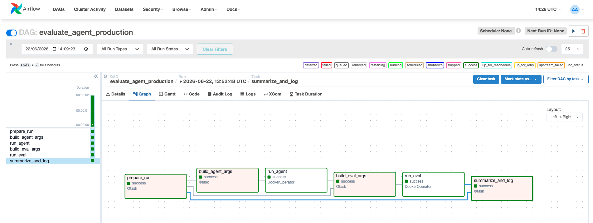
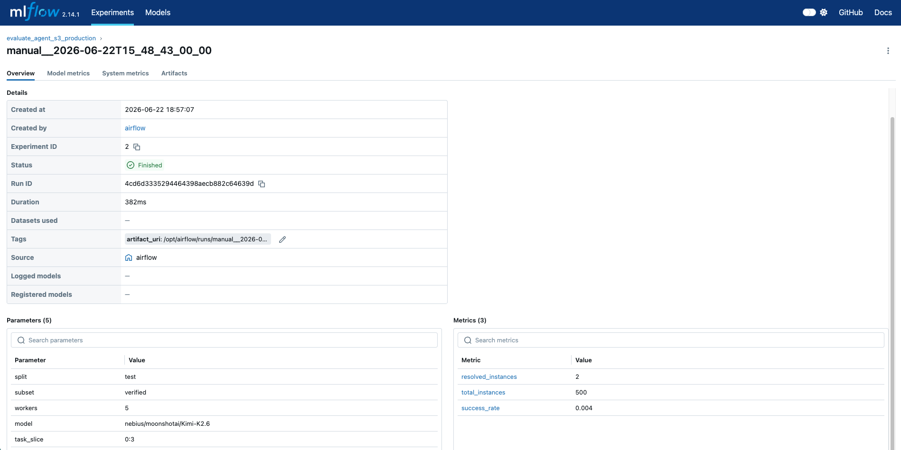
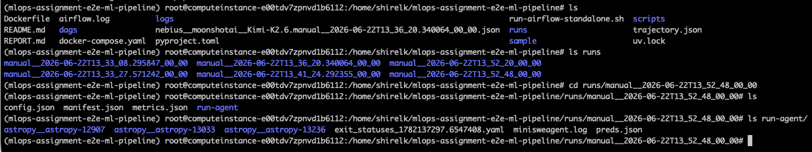
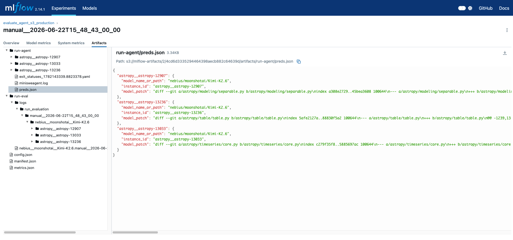

# MLOps Pipeline Report

## Architecture
This pipeline orchestrates the evaluation of `mini-swe-agent` on `SWE-bench` instances using an end-to-end containerized setup. 
It uses **Apache Airflow** (running inside Docker via `docker-compose`) to sequence the stages and capture execution state. 
Instead of polluting the host environment, the heavy-lifting tasks (running the AI agent and the SWE-bench evaluation harness) are spun up dynamically as isolated Docker-in-Docker sibling containers using Airflow's `DockerOperator`. 
Finally, the results are accurately parsed and tracked centrally in an **MLflow** instance running natively alongside Airflow.

## Artifact Layout
Each run produces a highly durable artifact tree within the shared `runs/` volume:
```
runs/manual__<timestamp>/
├── config.json          # Agent configuration (split, subset, workers, model, etc.)
├── run-agent/           # Agent execution artifacts
│   ├── astropy__astropy-<issue>/  # Container outputs
│   ├── minisweagent.log # Raw execution logs
│   ├── preds.json       # Generated patch predictions
│   └── trajectories/    # Complete LLM conversation traces
├── run-eval/            # SWE-bench evaluation outputs
│   └── <report>.json    # Detailed evaluation results containing resolved_instances
├── manifest.json        # High-level tracking and artifact URI
└── metrics.json         # Extracted aggregate success rates
```

## How to Trigger the DAG
1. Boot the orchestration cluster via `docker compose up -d` (ensure `NEBIUS_API_KEY` is exported).
2. Forward the Airflow UI port (`8080`) and MLflow UI port (`5000`) from the VM to your local machine.
3. Access Airflow at `http://localhost:8080` and log in (default: `admin` / `admin`).
4. Find the **`evaluate_agent_production`** DAG.
5. Click **Trigger DAG w/ config**. You can provide overriding parameters such as `workers` (default 5), `task_slice` (default "0:3"), and `model` (default "nebius/moonshotai/Kimi-K2.6").

## Reproducibility & Rerun Instructions
Because the inputs are cleanly defined in the `config.json` and the execution uses identical Docker images each time, you can easily reproduce a run:
- **By Run ID:** Identify a past run ID from MLflow or Airflow. Trigger a new DAG run overriding the `run_id` parameter to precisely overwrite/retry the original folder outputs, or look inside `runs/<run-id>/config.json` to extract the parameters for a fresh run.
- **Remote Artifacts:** For full scale setups, the artifacts need to be stored reliably. We achieved this by deploying **MinIO** alongside MLflow, effectively giving us an S3-compatible object storage bucket. During `summarize_and_log`, the pipeline uses `boto3` via `mlflow.log_artifacts()` to push the entire run folder natively to our `s3://mlflow-artifacts` bucket!

## MLflow Tracking
You can view the tracked experiments, extracted metrics (`total_instances`, `resolved_instances`, `success_rate`), and `artifact_path` in MLflow at `http://localhost:5000`.

## Obstacles & Solutions Encountered
During the Phase 3 (Production) upgrade, we successfully navigated several key engineering challenges:
1. **Docker-out-of-Docker (DooD) Configuration:** By default, Airflow's `DockerOperator` struggled to boot isolated worker containers. We solved this by binding the host's `/var/run/docker.sock` socket inside both the Airflow container and the worker containers, while explicitly disabling `mount_tmp_dir=False` to prevent host path conflicts.
2. **`working_dir` Templating Bug:** Airflow's `DockerOperator` does not Jinja-template the `working_dir` parameter. This caused evaluation failures since it interpreted `"{{ run_id }}"` as a literal string. We solved this by removing `working_dir` and injecting a `bash -c "cd <dir> && ..."` command to handle navigation natively inside the container.
3. **S3 Artifact Uploads:** To fulfill the Object Storage requirement without spinning up paid AWS resources, we added a MinIO container to `docker-compose`. We configured MLflow's default artifact root to `s3://mlflow-artifacts` and injected `AWS_ACCESS_KEY_ID` variables into the Airflow workers, allowing native S3 artifact duplication securely within the local cluster!

4. **`uv run` Environment Isolation:** When executing the `run_eval` task inside the container, `uv run` failed to identify the pre-installed `swebench` library because the non-interactive bash execution stripped the virtual environment context. We bypassed this entirely by invoking the absolute path to the pre-built Python binary (`/mlops-assignment/.venv/bin/python`) directly.
5. **MinIO Client API Deprecations:** Our `minio-createbuckets` initialization container failed to create the `mlflow-artifacts` bucket because the latest `minio/mc` docker image deprecated the `mc config host add` command. We solved this by refactoring the entrypoint script to use the modern `mc alias set` syntax.
6. **MLflow Artifact Root Caching:** When switching to S3, `mlflow.log_artifacts()` stubbornly tried to save files to the local disk, causing `Permission denied` errors. We discovered that MLflow permanently caches an experiment's `artifact_location` in its PostgreSQL database upon creation. We fixed this by creating a brand new experiment (`evaluate_agent_s3_production`) to force MLflow to inherit and save the new `s3://mlflow-artifacts` root path.

## Visual Evidence of Pipeline Execution

Below are the screenshots capturing the successful completion of the end-to-end evaluation pipeline:

### 1. Airflow Orchestration DAG


### 2. MLflow Experiment Tracking


### 3. Local Artifact Persistence


### 4. Remote Object Storage (S3 / MinIO)

